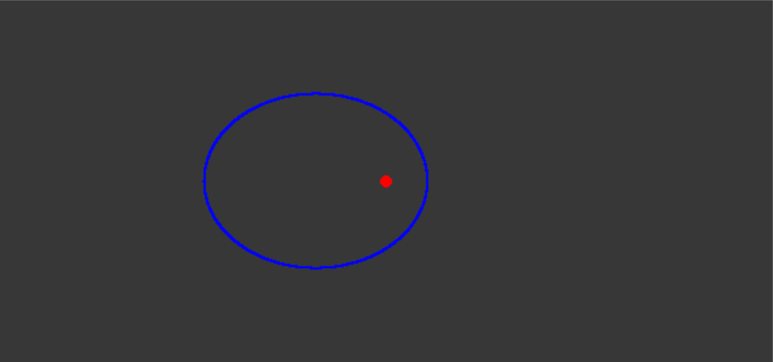

# Gravidade usando pygame
Simulação de Gravidade:

Órbita na simulação:

## Gravitação universal
Temos que, de acordo a lei da gravitação universal descrita por Isaac Newton: 
>
## Segunda Lei de Newton:
>
## Distância entre pontos:
>^{2}&space;&plus;&space;(y&space;-&space;y_{0})^{2}})

